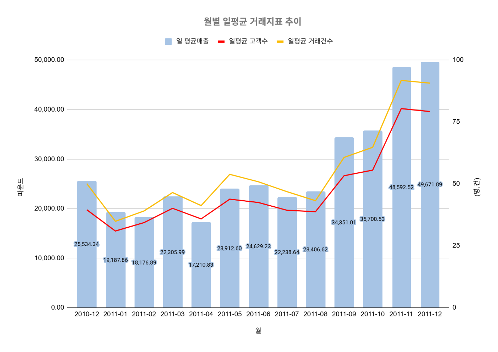
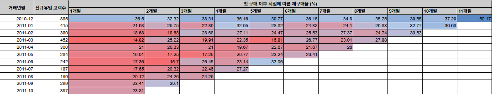
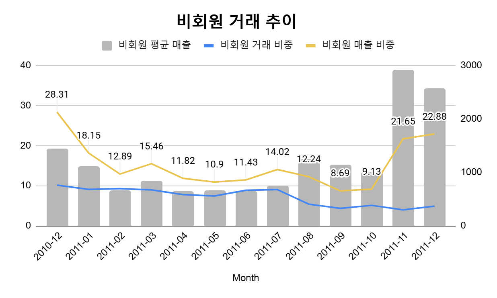

# E-commerce Sales Trend & Customer Retention Analysis

약 1년간의 e-commerce 거래 데이터를 활용해 매출 성장성, 연말 시즌성, 비회원 고액 거래, 고객 재구매 패턴을 분석한 프로젝트입니다.

본 프로젝트는 단순 매출 시각화가 아니라, **연말 수요 대응**, **고액 비회원 고객의 회원 전환**, **하절기 재구매 활성화**라는 의사결정에 필요한 근거를 도출하는 것을 목표로 했습니다.

---

## 1. Project Summary

- **무엇을 발견했는지:** 연말 매출 급증, 비회원 고액 거래 증가, 유입 시점별 재구매율 차이를 발견했습니다.
- **어떤 의사결정에 기여했는지:** 연말 재고/마케팅 강화, 비회원 회원가입 유도, 하절기 리텐션 캠페인 설계에 필요한 근거를 제공했습니다.
- **데이터로 만든 임팩트:** 2011년 12월 일평균 매출이 전년 동월 대비 약 95% 증가했고, 2011년 11~12월 비회원 매출 비중이 20% 이상으로 급증했다는 핵심 신호를 도출했습니다.
- **나의 역할:** 데이터 전처리, SQL 기반 지표 설계, 매출/비회원/코호트 분석, 시각화, 비즈니스 액션 도출을 수행했습니다.

---

## 2. Business Problem

### Background

해당 데이터는 2010년 12월부터 2011년 12월까지의 온라인 리테일 거래 데이터입니다. 상품 특성상 선물용 제품 판매 비중이 높고, 연말 시즌 수요가 매출에 큰 영향을 줄 가능성이 있습니다.

따라서 단순히 전체 매출을 보는 것보다, **월별 매출 흐름**, **고객수와 주문건수 변화**, **비회원 거래의 매출 기여도**, **고객 재구매 패턴**을 함께 분석할 필요가 있었습니다.

### Business Questions

1. 매출은 실제로 성장하고 있는가?
2. 어떤 시기에 고객수와 거래건수가 증가하는가?
3. 비회원 거래는 매출에 어떤 영향을 주는가?
4. 유입된 고객은 이후에도 재구매하는가?
5. 매출 성장과 고객 유지 관점에서 어떤 액션이 필요한가?

### Success Metrics

- 일평균 매출
- 일평균 구매고객수
- 일평균 구매건수
- 비회원 거래 비중
- 비회원 매출 비중
- 비회원 주문당 평균 매출
- 코호트별 재구매율

---

## 3. Dataset

### Data Period

- 2010-12-01 ~ 2011-12-09

### Raw Data Size

- 전체 데이터: 541,909 rows
- 컬럼 수: 8 columns

### Columns

| Column | Description |
|---|---|
| InvoiceNo | 거래 번호 |
| StockCode | 상품 코드 |
| Description | 상품명 |
| Quantity | 구매 수량 |
| InvoiceDate | 거래 일시 |
| UnitPrice | 상품 단가 |
| CustomerID | 고객 ID |
| Country | 구매 국가 |

---

## 4. Hypotheses & Analysis Design

### Hypothesis 1

연말 선물 수요로 인해 11~12월에 매출, 고객수, 거래건수가 크게 증가할 것이다.

### Hypothesis 2

비회원 거래 비중은 낮더라도, 특정 기간에는 고액 비회원 거래가 전체 매출에 큰 영향을 줄 수 있다.

### Hypothesis 3

유입 시점에 따라 고객의 재구매율이 다르며, 봄~여름 유입 고객은 상대적으로 재구매율이 낮을 수 있다.

### Analysis Methods

- SQL 기반 데이터 전처리
- 월별 일평균 KPI 분석
- 비회원 거래 및 매출 비중 분석
- 코호트 기반 재구매율 분석
- 월별 추세 시각화

---

## 5. Data Cleaning

실제 구매 거래만 분석하기 위해 다음 기준으로 데이터를 정리했습니다.

- `InvoiceNo`가 `C`로 시작하는 취소 거래 제거
- `Quantity <= 0` 거래 제거
- `UnitPrice <= 0` 거래 제거
- 상품코드 길이가 5자 미만인 비상품성 코드 제거
- 극단 수량값 `80995`, `74215` 제거
- `CustomerID`가 없는 거래는 비회원 거래로 분류
- 매출은 `Quantity * UnitPrice`로 계산

전처리 후 분석 대상 데이터는 약 527,801건입니다.

---

## 6. Key Findings

### Finding 1. 연말 매출 성장성이 뚜렷함

2011년 12월 일평균 매출은 49,671.89파운드로, 2010년 12월 25,534.34파운드 대비 약 95% 증가했습니다.

같은 기간 일평균 고객수는 약 100%, 일평균 거래건수는 약 81% 증가했습니다. 이는 단순히 객단가만 상승한 것이 아니라, 실제 고객 활동과 주문량이 함께 증가했음을 의미합니다.

**Business Meaning**

연말 시즌은 매출 성장에 가장 중요한 기간이며, 10월 이전부터 재고, 물류, 마케팅 준비가 필요합니다.

### Finding 2. 비회원 거래 비중은 낮지만 연말 매출 기여도가 큼

비회원 거래 비중은 월별로 감소하는 추세였지만, 2011년 11월과 12월에는 비회원 매출 비중이 각각 21.65%, 22.88%까지 상승했습니다.

특히 2011년 11월 비회원 주문당 평균 매출은 약 2,895파운드로 급증했습니다.

**Business Meaning**

비회원 중 고액 구매자가 존재하며, 이들을 회원으로 전환하면 CRM, 리텐션 마케팅, 재구매 유도에 활용할 수 있습니다.

### Finding 3. 고객 재구매율은 유입 시점에 따라 차이가 있음

12월 유입 고객은 이후 재구매율이 비교적 높았지만, 봄~여름 유입 고객은 상대적으로 낮은 재구매율을 보였습니다.

또한 동절기에 유입된 고객도 여름 시즌에는 재구매율이 낮아지는 경향이 있었습니다.

**Business Meaning**

하절기에는 고객 재방문을 유도하기 위한 별도 프로모션이 필요합니다. 예를 들어 시즌 할인, 리마인드 쿠폰, 재구매 캠페인 등을 운영할 수 있습니다.

---

## 7. Visualizations

### Monthly KPI Trend

월별 일평균 매출, 일평균 구매고객수, 일평균 구매건수 추이를 시각화했습니다.



### Cohort Retention Analysis

고객의 최초 구매월을 기준으로 이후 월별 재구매율을 분석했습니다.



### Non-member Transaction Trend

비회원 거래 비중, 비회원 매출 비중, 비회원 주문당 평균 매출을 분석했습니다.



상세 SQL과 요약은 `sql/03_non_member_analysis.sql` 및 `report/executive_summary.md`에서 확인할 수 있습니다.

---

## 8. Business Recommendations

### 1. 연말 수요 대응 강화

11~12월에 매출, 고객수, 거래건수가 모두 급증하므로 연말 시즌 전에 재고, 물류, 프로모션 계획을 선제적으로 준비해야 합니다.

**Action Items**

- 10월 이전 인기 상품 재고 확보
- 연말 선물 수요 대상 캠페인 운영
- 고수요 기간 물류/CS 리소스 증대

### 2. 고액 비회원 고객의 회원 전환 유도

11~12월 비회원 매출 비중과 주문당 평균 매출이 급증했습니다. 비회원 고객을 식별하고 회원 전환을 유도하면 잠재 우량고객 데이터를 확보할 수 있습니다.

**Action Items**

- 고액 비회원 구매자 대상 회원가입 혜택 제공
- 비회원 주문 완료 페이지에서 가입 유도
- 이메일, 전화번호 등 비회원 식별 key 확보

### 3. 하절기 재구매 활성화 캠페인 운영

봄~여름 유입 고객의 재구매율이 상대적으로 낮고, 여름 시즌 전반의 고객 재방문이 약합니다.

**Action Items**

- 하절기 시즌 할인 캠페인
- 기존 고객 대상 재방문 쿠폰 발송
- 여름 시즌 상품 추천 및 번들 프로모션 운영

---

## 9. Expected Impact

- 연말 고수요 기간의 판매 기회 손실 감소
- 고액 비회원 고객의 회원 전환을 통한 CRM 데이터 확보
- 하절기 재구매율 개선을 통한 비수기 매출 방어
- 시즌별 마케팅 예산 배분 근거 확보
- 고객 유입 시점별 리텐션 전략 수립

---

## 10. Limitations

- 데이터 기간이 약 1년으로 짧아 장기 시계열 예측 모델을 만들기에는 한계가 있습니다.
- 2011년 12월 데이터는 12월 9일까지로, 월 전체 데이터가 아닙니다.
- 비회원은 `CustomerID`가 없어 실제 고객 단위 재구매 분석이 불가능합니다.
- 상품 카테고리 정보가 없어 상품군별 분석은 `Description` 기반으로 추정해야 합니다.
- 외부 요인, 캠페인 여부, 재고 상황, 유입 채널 데이터가 없어 매출 변화의 원인을 완전히 설명하기는 어렵습니다.

---

## 11. Next Steps

- RFM 분석을 통한 VIP, 이탈위험, 신규 고객 세그먼트 분류
- 국가별 매출, 주문수, 객단가 비교
- 상품별 연말 판매 기여도 분석
- 취소/반품 거래 패턴 분석
- 2011년 12월 run-rate 기반 월말 매출 추정
- 회원가입 유도 캠페인 A/B 테스트 설계
- 하절기 리텐션 캠페인 효과 측정 설계

---

## 12. Project Structure

```text
sales-trend-analysis/
├── README.md
├── data/
│   └── sample_data_note.md
├── images/
│   ├── monthly_kpi_trend.png
│   ├── non_member_trend.png
│   └── cohort_retention.png
├── sql/
│   ├── 01_cleaning.sql
│   ├── 02_monthly_kpi_trend.sql
│   ├── 03_non_member_analysis.sql
│   └── 04_cohort_retention.sql
├── report/
│   └── executive_summary.md
└── docs/
    ├── 매출 핵심 지표 추세 분석.docx
    ├── 비회원 거래 추이 분석.docx
    ├── 선물용 제품 판매 데이터 컬럼 설명.docx
    └── 코호트분석.docx
```

---

## 13. Tools Used

- SQL / BigQuery
- Google Sheets
- Excel
- Word
- Data Visualization
- Cohort Analysis
